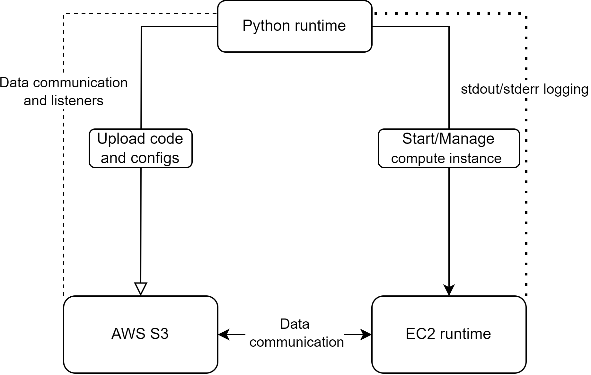

# EC2-Job-Runner
Utils to run a python job directly on an EC2 instance. The motivation - Sage Maker is much more expensive.  
With this repo you are able to:
- upload job scripts to an s3 bucket
- connect to an ec2 instance and run commands
- stream instance stdout to python stdout
- listen for log files on s3 and manage the jobs as necessary
  
A simplified communication diagram:  
  
  

Please, refer to a minimal example in ```example``` for more details